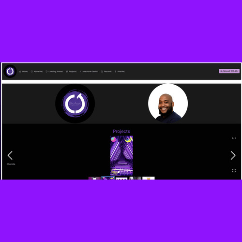
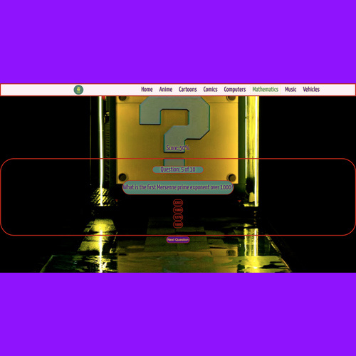
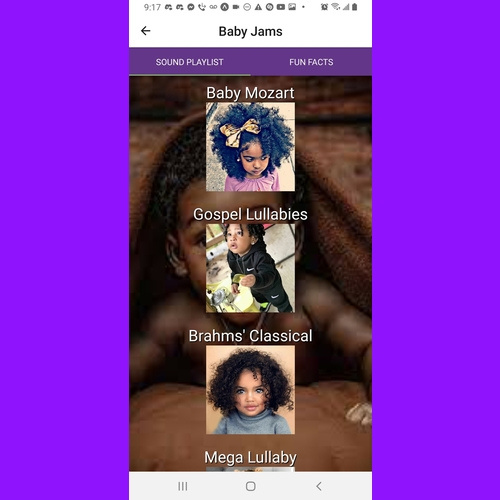
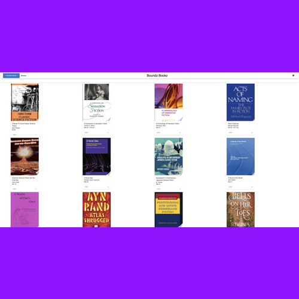

<!--                                                                HEADER                                                                            -->

<!-- Profile Views -->

 <!--                                                                CONTACT ME                                                                       -->
 <h2 align="center"> Contact Me </h2>

   

   

        
      
      
       
      
       
       
      
  

 
 <!--                                                                ABOUT ME                                                                         -->
 <h2 align="center"> About Me </h2>

  

  <h4 align="center" vertical-align="middle">
    
 As a software engineer based in NYC, I have a proven track record of
        success in the industry. I honed my skills at Fullstack Academy, an
        immersive and rigorous software engineering program. Since then, I have
        been freelancing for individuals and brands in multiple industries,
        delivering high-quality solutions that enhance user experiences.
    

    
 My passion for technology is matched by my commitment to lifelong
        learning. I constantly seek out new and innovative ways to solve
        problems and improve my software engineering skillset. I believe in
        combining best practices with cutting-edge solutions to create optimal
        results for my clients and their customers.
    

    
 My expertise lies in developing intuitive and visually stimulating user
        interfaces, leveraging libraries and frameworks such as React and React
        Native Expo. However, I am always looking for new opportunities to grow
        and learn. That's why I'm seeking a career transition from freelance to
        working at a company where communication, passion, and innovation are at
        the forefront.
    

     
 Currently, I am actively seeking collaborations with others in the
        industry. I am studying data structures and algorithms to further
        improve my skills, and I am excited to work on projects that cover a
        wide range of topics. As someone with a strong passion for
        entertainment, I would love to collaborate on projects related to music,
        TV/movies, or gaming. I am confident in my ability to bring value to any
        team or project, and I look forward to future opportunities to make an
        impact in the software engineering field.
    

  </h4>

<!--Codewars Activity-->

  <h2>Codewars Data Structure & Algorithm Activity</h2>
  

 <!--                                                                 Github Stats & Activity                                                                -->
 <h2 align="center"> Github Stats & Activity </h2>
 

   

  

<h2 align="center"> Tech Stack </h2>

<!--                         PROFICIENT LANGUAGES                        -->
<h4 align="center">Proficient Languages</h4>

  
   
   
    

<!--                         FAMILIAR LANGUAGES                        -->
<h4 align="center">Familiar Languages</h4>
<h6 align="center">Read Only</h6>

   
  

<!--                                                                FRONT-END                                                                         -->
<h4 align="center"> Front-End </h4>

   
  
   
   
   
   
   
  
  
    
  

<!--                                                                    BACKEND                                                                      -->
<h4 align="center"> Back-End </h4>

  
  
  
  
   
  </a>
    
   
  
  <!--
  
-->

<!--                                                                    Tools                                                                      -->
<h4 align="center"> Tools </h4>

  
  
  
   
  

<!--                                                               Spacer Div                                                                        -->

&nbsp;

<!-- Featured Projects --->

<h2>Personal Projects</h2>
 <table style="width: 100%">
        <tr>
          <td style="width: 50%; vertical-align: top">
            <h3 align="center" color="white">See Jones Engineer</h3>
            

              
                
              

                
                
              

              

                <strong
                  >Javascript, React, PrimeReact, Three.js, HTML5, CSS3</strong
                >
              

              

                I developed a fully responsive mobile-first portfolio website to
                showcase my UX/UI talents and personal projects. The website
                features a user-friendly platform that allows users to browse my
                works and reach out to schedule meetings or work. The
                technologies used to design and construct the website's
                front-end were carefully chosen to ensure a responsive,
                efficient, and intuitive UI/UX. I integrated JavaScript, React,
                PrimeReact, and Three.js to create an interactive and visually
                appealing website that engages users and meets their needs.
              

            

          </td>
          <td style="width: 50%; vertical-align: top">
            <h3 align="center" color="white">Hypnotiq 2.0</h3>
            

              
                
              

                
                
              

              

                <strong>React Native, Expo, Firebase, Cloud Firestore</strong>
              

              

                Hypnotiq 2.0 is a music player app that allows users to create,
                edit and delete music playlists, load music from their local
                device storage, and stream audio to help with sleep and study
                patterns. The app uses the latest industry technologies such as
                Javascript, React, CSS, Firebase, and Cloud Firestore to provide
                seamless audio playback and allow users complete control. In
                future iterations, the database design will be restructured to
                optimize functionality, and the app will include new features
                such as the ability to share playlists with others, comment on
                shared playlists, and direct message other users for admins and
                artists whose work has been shared.
              

            

          </td>
        </tr>
        <tr>
          <td style="width: 50%; vertical-align: top">
            <h3 align="center" color="white">IYKYK</h3>
            

              
                
              

                
                
              

              
<strong>TypeScript, React, HTML5, CSS3, Three.js</strong>

              

                IYKYK is a multiple choice quiz game where users can choose
                their quiz category preferences from a menu of options.
                Questions and answers are aggregated from an external API then
                formatted to meet the game's design. For the front-end of IYKYK,
                I used TypeScript, React, HTML5, CSS3, and Three.js
                to create visually appealing 3D animations and rendering. The
                game's navigation bar will be updated to include multi-nested
                menus and submenus, and the stretch goals include adding
                additional quiz topics and types, diversifying the categories,
                and implementing true/false questions. One of the main
                challenges I faced was learning the intricacies
                of TypeScript, but the syntactical sugar provided by TypeScript
                was extremely helpful in debugging. Overall, IYKYK was created
                as an experiment to enhance my understanding of
                TypeScript, 3D animations, and rendering.
              

            

          </td>
          <td style="width: 50%; vertical-align: top">
            <h3 align="center" color="white">Computer Love</h3>
            

              
                
              

                
                
              

              

                <strong
                  >React Native Expo, Redux, Express, PostgreSQL,
                  Node.js</strong
                >
              

              

                Computer Love is a mobile dating/networking application for
                users in the tech industry. The MVP allows users to
                register/login and swipe yes or no to dating/networking based on
                their preferences. The back-end is built with Node.js,
                PostgreSQL, Sequelize, and Express. Stretch goals include
                allowing users to deactivate/reactivate their accounts and
                report inappropriate behavior. Future plans include adding
                multiple photos and location-based matching. One of the main
                challenges was integrating the front-end with the back-end and
                designing/implementing the user matching/swiping logic. This project was completed with my team <strong>System Obsessed</strong>.
              

            

          </td>
        </tr>
         <tr>
          <td style="width: 50%; vertical-align: top">
            <h3 align="center" color="white">Hypnotiq</h3>
            

              
                
              

                
                
              

              
<strong>React Native, Expo</strong>
              

              
Hypnotiq is a mobile application that provides users with a list of sound categories to choose from, allowing them to select different options within each category to facilitate studying and sleep habits. The MVP includes five related facts for each of the five senses and an additional random fact for each category. Hypnotiq was constructed using React Native and Expo for the front-end. Future goals include making the app more inclusive, adding more music genres, and allowing users to create, save, and share playlists with others, as well as comment on shared playlists.

            

          </td>
          <td style="width: 50%; vertical-align: top">
            <h3 align="center" color="white">Boundz Bookstore</h3>
            

              
                
              

                
                
              

              
<strong>React, Redux, Node.js, PostgreSQL, Sequelize, Express, Material UI, HTML5, CSS3</strong>
              

              
Boundz Bookstore is an eCommerce bookstore that allows users and administrators to purchase books, modify purchase information, and access order history. The site features a persistent cart, new user registration functionality, and CRUD abilities for user and administrative accounts. The front-end was built using React, Redux, Material UI, HTML5, and CSS3, while the back-end was built using Node.js, PostgreSQL, Sequelize, and Express. The site is currently deployed on Vercel, but was previously hosted on Heroku. This project was completed with my team <strong>RobotsRUs</strong>.

            

          </td>
        </tr>
      </table>

<!--                                                                Spotify                                                                          -->

<h2 align="center">Vibing on Spotify</h2>

<!--                                                                FOOTER                                                                            -->

